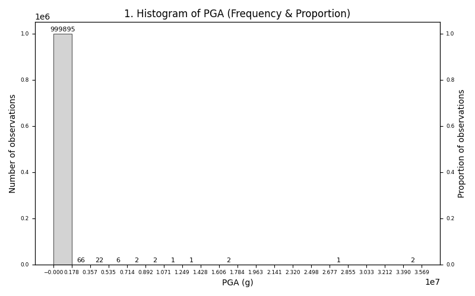
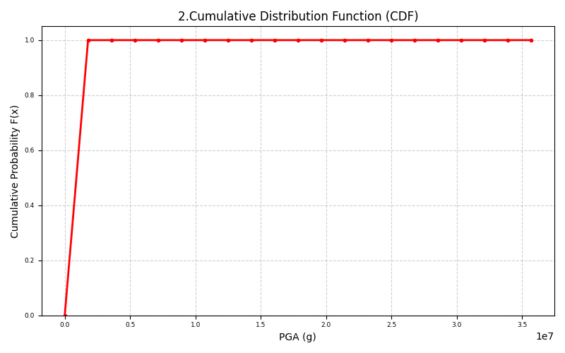

# PGA² + 2PGA Distribution Analysis (Monte Carlo)

Monte Carlo–based statistical analysis of the transformed random variable $Y = PGA^2 + 2PGA$, built on the Log-normal PGA distribution obtained from the PGA Histogram & CDF Analysis project. All statistics and histogram/CDF computations are implemented manually — no reliance on NumPy statistical functions.

## Problem Statement

For the values of the PGA probability distribution obtained from the previous project ([pga-histogram-cdf-analysis](https://github.com/mohammadmolaeinia/pga-histogram-cdf-analysis)), write a Python code that computes and plots the CDF and PDF (histogram) of the probability distribution of the transformed variable $Y = PGA^2 + 2PGA$. Which intervals of $Y$ have the highest frequency? Report the mean, range, standard deviation, and skewness of $Y$ as well.

## Project Files

| File | Description |
|---|---|
| `pgaMonteCarloAnalysis.py` | Monte Carlo Log-normal sampling of PGA, transformation, manual statistics, and plotting |
| `question.txt` | Text version of the assignment |
| `requirements.txt` | Python dependencies |
| `CDF.png` | Output CDF plot of $Y$ |
| `HistogramofPGA.png` | Output histogram (PDF) plot of $Y$ |

## Method Summary

1. **Log-normal model for PGA** — From ([pga-histogram-cdf-analysis](https://github.com/mohammadmolaeinia/pga-histogram-cdf-analysis)), the PGA dataset has $n = 12206$, mean $\bar{x} = 34.3392 $, standard deviation $s = 58.4308$, range $R = 986.6504$, and skewness $\gamma = 7.0695$. Because of this strong positive skewness, PGA is modeled as a Log-normal random variable whose underlying normal parameters are derived from the sample mean and standard deviation:

   - Log-normal σ: $\sigma = \sqrt{\ln\ \left(1 + \left(\frac{s}{\bar{x}}\right)^2\right)}$
   
   - Log-normal μ: $\mu = \ln(\bar{x}) - \frac{1}{2}\ \sigma^2$

3. **Monte Carlo sampling** — $10^6$ PGA samples are drawn from the Log-normal distribution using a fixed seed (`seed=42`) for reproducibility, then transformed into the target variable:

$$Y = PGA^2 + 2PGA$$

3. **Manual statistics on $Y$** — All measures are computed from scratch with direct mathematical formulas, no NumPy statistical functions:
   - Mean: $\bar{y} = \frac{1}{n}\sum_{i=1}^{n} y_i$
   - Range: $R = y_{\max} - y_{\min}$
   - Sample standard deviation: $s = \sqrt{\frac{\sum(y_i - \bar{y})^2}{n-1}}$
   - Skewness: $\gamma = \frac{\frac{1}{n}\sum(y_i - \bar{y})^3}{s^3}$

4. **Binning and frequency counting** — The range of $Y$ is divided into 20 equal-width bins. The bin borders, widths, and centers are computed manually, and each sample is assigned to its bin with an explicit loop. The last bin uses a closed upper bound (`<=`) so that $y_{\max}$ is not dropped. The bin with the highest frequency is then identified.

5. **PDF and CDF construction** — The empirical PDF is obtained as relative frequencies per bin, $f_i = \frac{\text{freq}_i}{n}$, plotted as a histogram with both frequency and proportion axes. The empirical CDF is built by cumulative summation of the relative frequencies at the bin borders:

$$F(x_j) = \sum_{i \le j} f_i$$

The CDF is plotted as a stepped red curve over the bin borders, with points marked at each edge.

NumPy is used only for sampling (`rng.lognormal`), the square-root in the parameter derivation, and plotting support — all statistics, binning, and cumulative sums are implemented manually.

## Requirements
```
pip install -r requirements.txt
```

## How to Run
```
python pgaMonteCarloAnalysis.py
```

## Output

**Plots generated:**

- Histogram (PDF) of $Y$ with frequency and proportion of observations
- Cumulative Distribution Function (CDF) of $Y$

## Sample Outputs

**Histogram (PDF)**



**CDF**



## Notes

- This project is a follow-up to PGA Histogram & CDF Analysis and reuses its ([pga-histogram-cdf-analysis](https://github.com/mohammadmolaeinia/pga-histogram-cdf-analysis)) PGA statistics ($n$, mean, standard deviation) as the basis of the Log-normal model.
- It was developed as part of an academic exercise related to uncertainty modeling, fuzzy variables, and probabilistic simulation in engineering applications.
